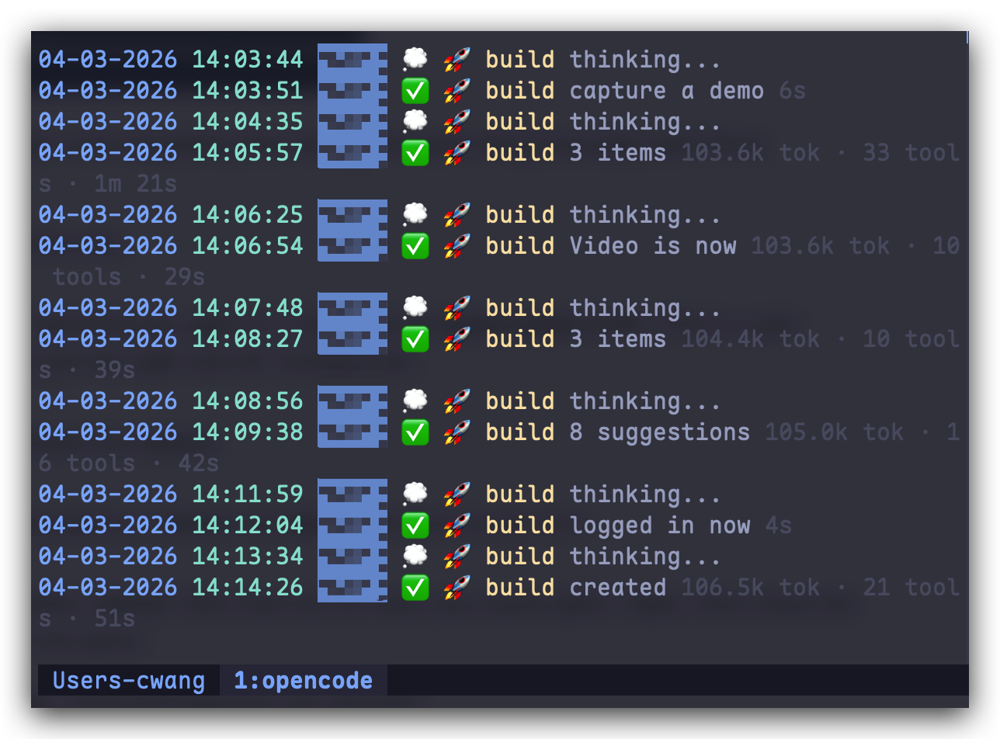

# tmux-notify Plugin

Intelligent notification tracking for opencode agents. Works with or without tmux.

## Demo



## Features

- **tmux-optional** - Full functionality with tmux, graceful degradation without
- **Ghostty-native** - Supports Ghostty tab titles when tmux is not available
- **Per-project notifications** - Each project directory gets its own log file
- **Per-window isolation** - Multiple windows each have separate notification streams
- **Smart summarization** - Detects questions, suggestions, actions, and code responses
- **Rich metadata** - Shows tokens used, tool calls, and duration
- **Colored output** - Different colors for date, time, directory name, agent, status, and metadata
- **macOS notifications** - System notifications via osascript with project name
- **Log rotation** - Automatic rotation at 1000 lines

## Requirements

| Package | Version | Required | Description |
|---------|---------|----------|-------------|
| **opencode** | any with ES module support | Yes | Main application. Plugin auto-loads from `~/.config/opencode/plugins/` |
| **tmux** | ≥ 3.0 | No | Full tmux sidebar experience with popups and dedicated panes |
| **Ghostty** | any | No | Native tab title support (macOS terminal) |

---

## Installation

### One-line install

```bash
curl -fsSL https://raw.githubusercontent.com/wcf778/tmux-notify/main/install.sh | bash
```

Or with wget:
```bash
wget -qO- https://raw.githubusercontent.com/wcf778/tmux-notify/main/install.sh | bash
```

### tmux setup (optional)

After installation, add to `~/.tmux.conf`:
```bash
source-file ~/.config/opencode/plugins/tmux-notify/tmux-bindings.conf
```

---

## Usage

<details open>
<summary><strong>Workflow A: tmux Users (Full Experience)</strong></summary>

### Start dev-workspace

```bash
dev-workspace ~/Projects/myapp
```

### Add to existing tmux session

Press `Prefix + M` to add a notification pane instantly.

### Keybindings (tmux)

| Key | Action |
|-----|--------|
| `Prefix + M` | Add notification pane to current window |
| `Prefix + n` | Show notifications popup |
| `Prefix + N` | Clear notification history |
| `Prefix + m` | Toggle to notification pane |

</details>

<details>
<summary><strong>Workflow B: Ghostty/Terminal Only (No tmux)</strong></summary>

### Terminal 1: Run opencode

```bash
opencode
```

### Terminal 2: Run notification viewer

```bash
notification-viewer.sh ~/Projects/myapp
```

Or use Ghostty splits:
1. Split your Ghostty window
2. In the new pane: `notification-viewer.sh ~/Projects/myapp`
3. In the original pane: `opencode`

The notification viewer shows:
- macOS system notifications (plugin sends automatically)
- Terminal pane with live notification log
- Ghostty tab titles (if using Ghostty)

### Keybindings (Ghostty)

| Key | Action |
|-----|--------|
| `Cmd+Shift+n` | Toggle notification pane (after adding config) |

Add to `~/.config/ghostty/config`:
```
bind = cmd+shift+n !exec ~/.config/opencode/plugins/examples/notification-viewer.sh
```

</details>

---

## Notification Viewer

The `notification-viewer.sh` script displays notifications in any terminal pane:

```bash
# View notifications in current directory
notification-viewer.sh

# View notifications in specific project
notification-viewer.sh ~/Projects/myapp

# Show only the latest notification
notification-viewer.sh --latest
```

Press `Ctrl+C` to exit, or create `/tmp/notification-viewer-exit` to gracefully exit.

---

## Architecture

```
┌─────────────────────────────────────────────────────────────────┐
│                        opencode session                          │
├─────────────────────────────────────────────────────────────────┤
│                                                                  │
│  ┌──────────────┐    ┌──────────────┐    ┌──────────────────┐     │
│  │   tmux       │    │   Ghostty    │    │   Log file      │     │
│  │   (if avail) │    │   (if Ghostty)│   │   (always)      │     │
│  └──────┬───────┘    └──────┬───────┘    └────────┬─────────┘     │
│         │                   │                     │               │
│         └───────────────────┴─────────────────────┘               │
│                             │                                    │
│              tmux-notify plugin (tmux-optional)                  │
│                                                                  │
└─────────────────────────────────────────────────────────────────┘
```

### Feature Matrix

| Feature | tmux | Ghostty (no tmux) | Terminal only |
|---------|------|-------------------|---------------|
| Status display | ✅ tmux display-message | ✅ Tab title | ❌ |
| macOS notifications | ✅ | ✅ | ✅ |
| Notification log | ✅ | ✅ | ✅ |
| Sidebar pane | ✅ | ⚠️ Split + manual | ⚠️ Split + manual |

---

## Output Format

```
04-02-2026 14:06:19 myapp ✅ 💡 plan 2 questions 46.1k tok · 90 tools · 2m 3s
04-02-2026 14:05:30 api 💭 🚀 build thinking... 12.3k tok · 15 tools · 45s
```

### Color Scheme

| Field | Color | Example |
|-------|-------|---------|
| Date | Blue | `04-02-2026` |
| Time | Cyan | `14:06:19` |
| Directory | Palette | `myapp` (unique color per project) |
| Status Emoji | - | `✅` or `💭` |
| Agent Emoji | - | `💡` or `🚀` |
| Agent Name | Yellow | `plan` |
| Summary | White | `2 questions` |
| Metadata | Gray | `46.1k tok · 90 tools · 2m 3s` |

---

## Status Emojis

| Emoji | Status | Meaning |
|-------|--------|---------|
| 💭 | busy | Agent is thinking/working |
| ✅ | idle | Task completed successfully |
| 🚨 | error | Error occurred |
| ⏳ | waiting | Waiting for user input |
| 💤 | paused | Session paused |
| 🛑 | stopped | Session stopped |

---

## Agent Emojis

| Agent Type | Emoji |
|------------|-------|
| build | 🚀 |
| plan | 💡 |
| debug | 🔧 |
| test | 🧪 |
| review | 👀 |
| doc | 📝 |
| default | 💼 |

---

## Smart Summarization

The plugin intelligently summarizes agent responses:

- **Multi-choice questions** - Detects A/B/C/D options, shows "N choices"
- **Question lists** - Shows "N questions" for numbered question lists
- **Bullet lists** - Counts items in "- item" format
- **Section headers** - Detects topics like "Code & Development"
- **Action verbs** - Extracts "created: X", "fixed: Y", "added: Z"
- **Acknowledgments** - Shortcuts "ok", "yes", "sure" responses
- **Code responses** - Shows "provided code" when code blocks detected
- **Multilingual** - Supports English, Chinese, Japanese

### Summary Examples

| Response Type | Summary |
|---------------|---------|
| `- A) Option A\n- B) Option B` | `2 choices` |
| `- Read files\n- Write files` | `2 suggestions` |
| `Code & Development\n- Build\nAutomation\n- Browser` | `2 topics` |
| `Here's what I found...` (short) | `Here's what I found...` |
| `Sure, I'll help` | `ok` |

---

## macOS Notifications

When an agent completes or errors, a system notification is sent with:
- **Title**: `directory · status-icon agent-icon summary`
- **Body**: `tokens tok · tools tools · duration`

---

## Project Structure

```
~/Projects/myapp/
├── .opencode/
│   ├── notifications-ghostty-1-ses_abc123.log  ← Ghostty window 1
│   ├── notifications-ghostty-2-ses_def456.log  ← Ghostty window 2
│   └── notifications-cwang41-w1-ses_ghi789.log  ← tmux window 1
```

### Symlink Structure (tmux only)

Each tmux window uses its own symlink:
- `~/.tmux-notify-cwang41-w1.log`
- `~/.tmux-notify-cwang-my_project7-w1.log`

---

## tmux Sidebar Setup

<details>
<summary>Show tmux setup options</summary>

### Option 1: Add to existing tmux session (Recommended for existing users)

If you already have a tmux workflow, just add one line to your `~/.tmux.conf`:

```bash
source-file ~/.config/opencode/plugins/examples/tmux-bindings.conf
```

Then use these shortcuts in any tmux session:

| Key | Action |
|-----|--------|
| `Prefix + M` | Add notification pane to current window |
| `Prefix + n` | Show notifications popup |
| `Prefix + N` | Clear notification history |
| `Prefix + m` | Toggle to notification pane |

### Option 2: Full dev-workspace (fresh start)

The `dev-workspace` script creates a 4-pane tmux layout:

```
┌─────────────────┬─────────────────┐
│   Sidebar       │   Yazi          │
│   (notifications)│   (file browser)│
├─────────────────┼─────────────────┤
│   Terminal      │   opencode      │
│                 │                 │
└─────────────────┴─────────────────┘
```

See `examples/dev-workspace` for the full script.

### Option 3: Manual tmux-adopt-notify

Run this command in any tmux session to add the notification pane:

```bash
tmux-adopt-notify
```

This splits your current window and adds a notification sidebar without disturbing your existing layout.

</details>

---

## Ghostty/Terminal Sidebar Setup

<details>
<summary>Show terminal setup options</summary>

### One-Key Setup (Recommended)

Add this line to your Ghostty config (`~/.config/ghostty/config`):

```
# Create split with notification viewer (Cmd+Shift+n)
bind = cmd+shift+n !exec ~/.config/opencode/plugins/examples/notification-viewer.sh
```

Then just press `Cmd+Shift+n` in Ghostty to toggle the notification pane.

### Manual Setup

**Ghostty Split:**
1. `Cmd+d` to split window
2. Type: `notification-viewer.sh ~/your-project`
3. Switch back, run `opencode`

**iTerm2 / Any Terminal:**
Same approach - split or new tab, run `notification-viewer.sh`, then use opencode in the other pane.

</details>

---

## Clear Notifications

```bash
# Clear notification history for current project
clear-notifications.sh

# Or with specific project
clear-notifications.sh ~/Projects/myapp
```

---

## Configuration

### Environment Variables

| Variable | Default | Description |
|----------|---------|-------------|
| `TERM_PROGRAM` | auto | Set to `Ghostty` for Ghostty-specific features |

### Plugin Options

Edit `tmux-notify.js` to adjust:

- `DEBUG` (line 5) - Enable/disable debug logging
- `C` object (line 42) - ANSI colors
- `SESSION_PALETTE` (line 55) - 12-color palette for directory badges
- `STATUS_EMOJI` / `AGENT_EMOJI` - Emoji mappings

---

## Events Tracked

| Event | Action |
|-------|--------|
| `session.created` | Initializes session, resets state, creates log |
| `message.updated` | Captures agent name, detects session/directory changes |
| `message.part.updated` | Tracks tool calls, tokens, text |
| `session.status` (busy) | Shows 💭 thinking notification |
| `session.status` (idle) | Shows ✅ done with smart summary |
| `session.status` (error) | Shows 🚨 error notification |
| `session.error` | Shows 🚨 error notification |

---

## Debugging

```bash
# Enable debug mode
DEBUG=true node ~/.config/opencode/plugins/tmux-notify.js

# Check debug log
tail -f ~/.tmux-plugin-debug.log

# Check logs
ls ~/.opencode/notifications-*.log
tail -f ~/.opencode/notifications-*.log
```
